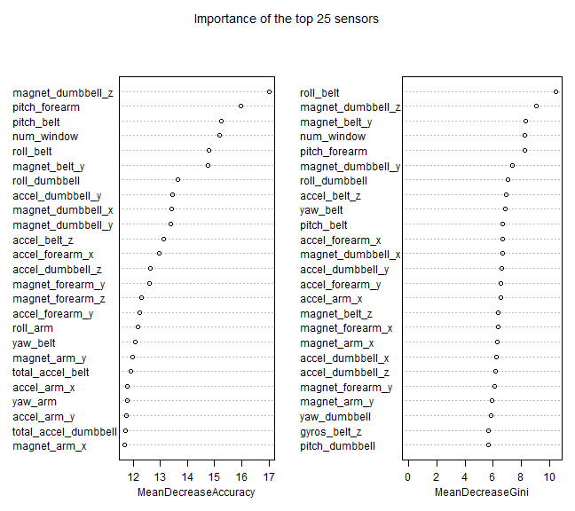

Predictive Machine Learning - Exercise Activity
========================================================
The goal of this assignment is to predict the type of exercize performed based on sensor data.  This analysis will use the default values for a random forest model due to its high accuracy and acceptable computation time for non-linear data.  

## Data Exploration
First the data is read in and the training group is broken apart further into training (60%) and testing (40%) groups.

 
```r
# To get reproducable results everytime
set.seed(85)
library(caret, quietly = TRUE)

# Have r run on multiple cores/threads
library(doParallel, quietly = TRUE)
cl = makeCluster(detectCores())
registerDoParallel(cl)

# Read in the data
training <- read.csv("pml-training.csv")
testing <- read.csv("pml-testing.csv")

# Separate test data into two groups
training <- training[, -c(1, 3:5)]  #First column is redundant, remove noisy time data
inTrain <- createDataPartition(y = training$classe, p = 0.2, list = FALSE)
train1 <- training[inTrain, ]
test1 <- training[-inTrain, ]
```


## Cleaning Data
The next step is to identify features that contain mostly NaNs or will not contribute to the model due to low or near-zero variance. 

```r
nna <- apply(train1, 2, function(x) {
    mean(is.na(x))
}) < 0.9
train1 <- train1[, nna]

nzv <- nearZeroVar(train1, saveMetrics = TRUE)
nzv1 <- rownames(subset(nzv, nzv == TRUE))
train1 <- train1[, -which(names(train1) %in% nzv1)]
```


## Creating the model
This table shows the results from using the train1 subset of the training data.  The error rate of the model on the training data is 0.9XXXXX

```r
modFit <- train(classe ~ ., data = train1, method = "rf", importance = TRUE)
```

```
## Loading required package: randomForest
## randomForest 4.6-7
## Type rfNews() to see new features/changes/bug fixes.
```

```r
modFit$finalModel$confusion
```

```
##      A   B   C   D   E class.error
## A 1115   1   0   0   0   0.0008961
## B   11 739   9   1   0   0.0276316
## C    0  11 672   1   1   0.0189781
## D    0   1  10 632   1   0.0186335
## E    0   1   2   7 712   0.0138504
```


## Cross Validation
The validation portion of the training data is used to determine the accuracy of the model.  The <b>accuracy is 0.9XXX</b> and the <b>out of sample error is 0.XXXX</b>.  We expected the out of sample error to be low, largely due to the large number of observations and features for the model to use.    

```r
confusionMatrix(predict(modFit, newdata = test1), test1$classe)
```

```
## Confusion Matrix and Statistics
## 
##           Reference
## Prediction    A    B    C    D    E
##          A 4462   55    4    0    0
##          B    1 2944   31    1   10
##          C    0   37 2699   22    5
##          D    0    1    3 2549   28
##          E    1    0    0    0 2842
## 
## Overall Statistics
##                                         
##                Accuracy : 0.987         
##                  95% CI : (0.985, 0.989)
##     No Information Rate : 0.284         
##     P-Value [Acc > NIR] : <2e-16        
##                                         
##                   Kappa : 0.984         
##  Mcnemar's Test P-Value : NA            
## 
## Statistics by Class:
## 
##                      Class: A Class: B Class: C Class: D Class: E
## Sensitivity             1.000    0.969    0.986    0.991    0.985
## Specificity             0.995    0.997    0.995    0.998    1.000
## Pos Pred Value          0.987    0.986    0.977    0.988    1.000
## Neg Pred Value          1.000    0.993    0.997    0.998    0.997
## Prevalence              0.284    0.194    0.174    0.164    0.184
## Detection Rate          0.284    0.188    0.172    0.162    0.181
## Detection Prevalence    0.288    0.190    0.176    0.164    0.181
## Balanced Accuracy       0.997    0.983    0.991    0.994    0.993
```


## Prediction of the original test dataset
Here are the results for predicting the exercise for the 20 cases in the testing dataset.  After submission, the model predicted the 20 cases with 100% accuracy.  

```r
answers <- predict(modFit, newdata = testing)
answers
```

```
##  [1] B A A A A E D B A A B C B A E E A B B B
## Levels: A B C D E
```

```r
# pml_write_files = function(x) { n = length(x) for (i in 1:n) { filename =
# paste0('./problem_id_', i, '.txt') write.table(x[i], file = filename,
# quote = FALSE, row.names = FALSE, col.names = FALSE) } }
# pml_write_files(answers)
```


```r
rf = modFit$finalModel
varImpPlot(rf, n.var = nrow(rf$importance[1:25, ]), main = "Importance of the top 25 sensors")
```

 


