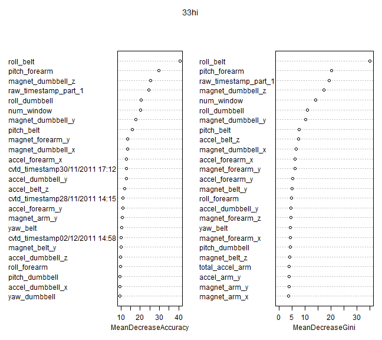

Predictive Machine Learning - Exercise Activity
========================================================
The goal of this assignment is to predict the type of exercize performed based on sensor data.  This analysis will use the default values for a random forest model due to its high accuracy and acceptable computation time.  

## Data Exploration
First the data is read in and the training group is broken apart further into training (60%) and testing (40%) groups.


```r
# To get reproducable results everytime
set.seed(85)
library(caret, quietly = TRUE)

# Have r run on multiple cores/threads
library(doParallel, quietly = TRUE)
cl = makeCluster(detectCores())
registerDoParallel(cl)

# Read in the data
training <- read.csv("pml-training.csv")
testing <- read.csv("pml-testing.csv")

# Separate test data into two groups
training <- training[, -c(1)]  #First column is redundant
inTrain <- createDataPartition(y = training$classe, p = 0.1, list = FALSE)
train1 <- training[inTrain, ]
test <- training[-inTrain, ]
```


## Cleaning Data
The next step is to identify features that contain mostly NaNs or will not contribute to the model.  

```r
nna <- apply(train1, 2, function(x) {
    1 - sum(is.na(x))/nrow(train1)
}) > 0.03
train1 <- train1[, nna]

# nna <- apply(train1, 2, function(x) {mean(is.na(x))}) < 0.03 train1 <-
# train[, nna]

nzv <- nearZeroVar(train1, saveMetrics = TRUE)
exclude_nzv <- rownames(subset(nzv, nzv == TRUE))
train1 <- train1[, -which(names(train1) %in% exclude_nzv)]
```


###Creating the model

```r
modFit <- train(classe ~ ., data = train1, method = "rf", importance = TRUE)
```

```
## Warning: There were missing values in resampled performance measures.
```


```r


modFit$finalModel$confusion
```

```
##   A B C D E class.error
## A 0 1 1 0 0      1.0000
## B 1 1 0 1 0      0.6667
## C 0 0 4 0 0      0.0000
## D 0 0 2 0 1      1.0000
## E 0 1 1 1 3      0.5000
```

```r
confusionMatrix(predict(modFit, newdata = test), test$classe)
```

```
## Loading required package: randomForest
## randomForest 4.6-7
## Type rfNews() to see new features/changes/bug fixes.
```

```
## Error: all arguments must have the same length
```

```r

answers <- predict(modFit, newdata = testing)
```

```
## Error: variables 'max_roll_belt', 'max_picth_belt', 'min_roll_belt',
## 'min_pitch_belt', 'amplitude_roll_belt', 'amplitude_pitch_belt',
## 'var_total_accel_belt', 'avg_roll_belt', 'stddev_roll_belt',
## 'var_roll_belt', 'avg_pitch_belt', 'stddev_pitch_belt', 'var_pitch_belt',
## 'avg_yaw_belt', 'stddev_yaw_belt', 'var_yaw_belt', 'var_accel_arm',
## 'avg_roll_arm', 'stddev_roll_arm', 'var_roll_arm', 'avg_pitch_arm',
## 'stddev_pitch_arm', 'var_pitch_arm', 'avg_yaw_arm', 'stddev_yaw_arm',
## 'var_yaw_arm', 'max_roll_arm', 'max_picth_arm', 'max_yaw_arm',
## 'min_roll_arm', 'min_pitch_arm', 'min_yaw_arm', 'amplitude_roll_arm',
## 'amplitude_pitch_arm', 'amplitude_yaw_arm', 'max_roll_dumbbell',
## 'max_picth_dumbbell', 'min_roll_dumbbell', 'min_pitch_dumbbell',
## 'amplitude_roll_dumbbell', 'amplitude_pitch_dumbbell',
## 'var_accel_dumbbell', 'avg_roll_dumbbell', 'stddev_roll_dumbbell',
## 'var_roll_dumbbell', 'avg_pitch_dumbbell', 'stddev_pitch_dumbbell',
## 'var_pitch_dumbbell', 'avg_yaw_dumbbell', 'stddev_yaw_dumbbell',
## 'var_yaw_dumbbell', 'max_roll_forearm', 'max_picth_forearm',
## 'min_roll_forearm', 'min_pitch_forearm', 'amplitude_roll_forearm',
## 'amplitude_pitch_forearm', 'var_accel_forearm', 'avg_roll_forearm',
## 'stddev_roll_forearm', 'var_roll_forearm', 'avg_pitch_forearm',
## 'stddev_pitch_forearm', 'var_pitch_forearm', 'avg_yaw_forearm',
## 'stddev_yaw_forearm', 'var_yaw_forearm' were specified with different
## types from the fit
```

```r
# pml_write_files = function(x) { n = length(x) for (i in 1:n) { filename =
# paste0('./problem_id_', i, '.txt') write.table(x[i], file = filename,
# quote = FALSE, row.names = FALSE, col.names = FALSE) } }
# pml_write_files(answers)
```


```r
rf.model = modFit$finalModel
varImpPlot(rf.model, n.var = nrow(rf.model$importance[1:25, ]), main = "33hi")
```

 


